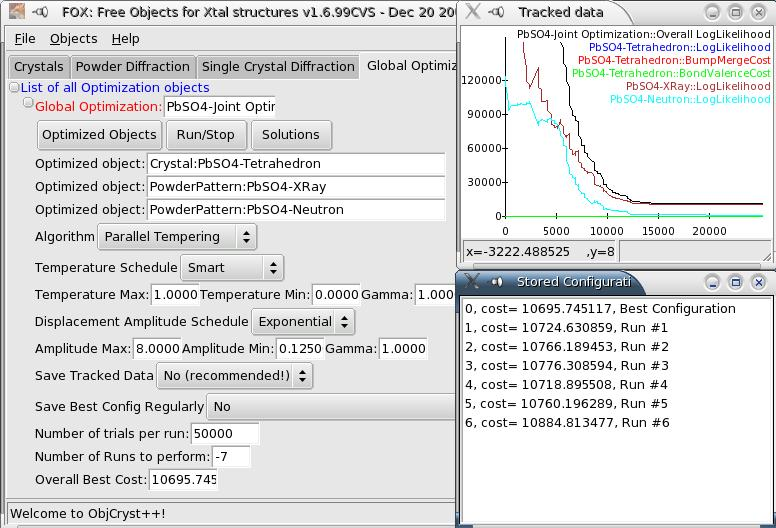

.. _manual_algorithms:

Graphical Interface for Global Optimization Algorithms
======================================================

Menus
-----
* Use the *"Objects"* to define the objects that you want to use (i.e. the *crystal structure* and the associated *diffraction dataset(s)* ).

Algorithm Options
-----------------

Algorithm
^^^^^^^^^
You can choose between Parallel Tempering (highly recommended) and Simulated Annealing (use this only if you know how... you'd have to carefully choose the number of trials and temperature schedule). Normally, the default choice (Parallel Tempering) should *not* be changed.

Temperature
^^^^^^^^^^^
These are the minimum and maximum temperatures to ensure that the algorithm will search all possible configurations, while insisting on the best configurations. **It is highly recommended not to change the default choices, with a "smart" temperature schedule which will be tuned by the algorithm.**

If you choose a different schedule than 'smart', then the the meaning of the max, min and gamma parameters is the following (nb is the number of parallel worlds (30) (for parallel tempering), or the number of trials (for simulated annealing) ; i is the index of the world (for parallel tempering) or the trial number (for simulated annealing).

* Boltzmann: T= Tmin*log(nb-1)/log(i+2)
* Cauchy: T= Tmin*(nb-1)/(i+1)
* Exponential: T=Tmax*(Tmin/Tmax)^(i/(nb-1))
* Gamma: T= Tmax+(Tmin-Tmax)*(i/(nb-1))^gamma
* Smart: the temperature is automatically adjusted to get between 10 and 30% of trials accepted

Displacement amplitude
^^^^^^^^^^^^^^^^^^^^^^
These are used to define the amplitude of displacements of all parameters during random moves. Again, **you should not change the default parameters which should be fine for any optimization, with an exponential schedule**.

If you choose a different schedule than 'smart', then the the meaning of the max, min and gamma parameters is the following (nb is the number of parallel worlds (30) (for parallel tempering), or the number of trials (for simulated annealing) ; i is the index of the world (for parallel tempering) or the trial number (for simulated annealing).

* Boltzmann: A= Amin*log(nb-1)/log(i+2)
* Cauchy: A= Amin*(nb-1)/(i+1)
* Exponential: A=Amax*(Amin/Amax)^(i/(nb-1))
* Gamma: A= Amax+(Amin-Amax)*(i/(nb-1))^gamma
* Smart: the amplitudeis automatically adjusted to get between 10 and 30% of trials accepted

Options
-------

There are several options available:

* **Save Tracked data**: this will save the data which is displayed in the Tracker window in a text file. This is only useful for heavy testing of Fox, so normally you should not use it.
* **Save Best Config Regularly**: this allows you to save regularly the "best" configuration reached by Fox. Note that the saved xml files will always be in the working directory (i.e. the one from which you launched FOX, *or* the directory of the FOX application). *The recommended choice is to save after each run* (see below on the use of *Multiple Runs*).
* **Automatic Least Squares Refinement** (**new in Fox >= 1.8.2**) : this allows the Monte-Carlo algorithm to run least-squares (lsq) optimization during and/or at the end of the optimization. This is recommended, as it greatly improves the speed at which the correct solution is reached. Nevertheless the following should be noted:

  * Only the structural parameters, the data scale and the preferred orientation fraction and amplitude (if applicable) are refined - this is not a full Rietveld refinement.
  * This is compatible with rigid atom groups (starting from Fox 1.9.0)
  * For relatively simple structure (e.g. Cimetidine) running these least squares fit will take only a few seconds - for more complex ones it can take longer - so be patient, particularly at the end of the run when 20 lsq cycles are run.
  * If the lsq run is made while the algorithm is far from the global minimum, a molecule could end up *heavily distorted*. *This is normal* - the algorithm will balance the molecule restraints and the diffraction data Chi^2 to get the best overall cost. Even if you do not see it, after the lsq refinement has been done the global optimization algorithm will bring back the Molecule to its normal conformation and enforce more strictly the restraints - but you will not see it until a correct conformation reaches a cost lower than the one given by the zealous lsq refinement.
  * *It is important to understand that to reach the global minimum quickly, the algorithm should be allowed to distort the molecule in intermediate stages - when using automatic lsq refinements, you should wait until a solution that respects the molecular restraints is proposed - it * **will** *come much faster with this option*.

Running the optimization
------------------------
You can choose between two types of runs (from the *"Run/Stop"* menu):

* **Single Run**: in this mode Fox runs for a fixed number of trials, starting from the current configuration, and then stops with the best configuration.
* **Multiple Run**: in this mode Fox will do several *runs* for the user-chosen number of trials, then store the configuration, and re-start another run. *The configuration is randomized at the beginning of each run* (including the first one).

Normally you should *always* use the *multiple runs* mode, in order to obtain several solutions. The main objective is not to ensure that the global minimum will be reached, since the parallel tempering algorithm already garanties that. But it will *provide several solutions* so that you can have a better feeling about whether you have found the actual global minimum: if you find repeatedly the same solution,then that should be it.

The only case when you should not be using a multiple run is if you want to optimize your structure in several stages (increasing progressively the number of degrees of freedom).

Before running the optimization, put in the **number of trials per run** the desired number of trials. For a *single run*, you can use any large number (as long as you use Parallel Tempering), i.e. 100 million trials or more. For a *multiple runs*, you should choose a number depending on the complexity of the structure, e.g.:

* For the PbSO4 structure, 50000 trials/run
* For Cimetidine, 1000000 trials/run
* For more complex structure, 10 million trials/run should be OK

During the optimization, a *Tracked Data* window will open and display the evolution of the various cost functions (the Chi^2^ of the different data sets, etc...). To stop the optimization, just use again the *"Run/Stop"* menu.

If you have used a *multiple run*, you can use the *"Solutions"* menu to browse the obtained solutions. Just clicking on any of the solutions listed will restore that configuration and update the different displays (crystal 3D structure, powder pattern,...).

Least-squares minimisation
--------------------------
From the *"Run/Stop"* menu you can select *"Least Squares fit"* - this will refine the structure, the diffraction data scale as well as the preferred orientation fraction and amplitude parameters (if applicable) for 20 cycles. After the refinement is finished you can browse the results from the intermediate cycles using the *"Solutions"* menu.
