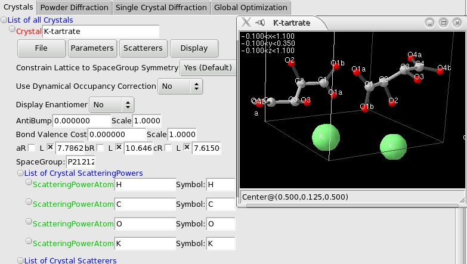
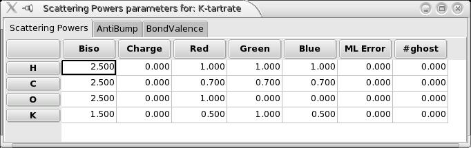
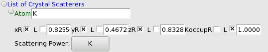
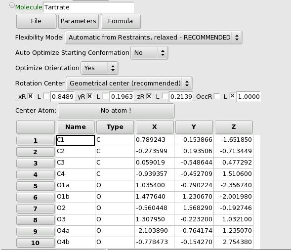
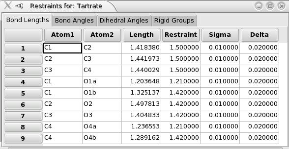

.. _manual_crystal:

Crystal Structures
==================
To know where to begin, **make sure you have read the** :ref:`Fox Tutorials <tutorials>` **first !**

3D Crystal view
^^^^^^^^^^^^^^^
You can open a 3D view (uses OpenGL) of the Crystal structure from the *"Display"* menu. You can then control the view with the mouse:

* Dragging with the left button will rotate the view, simulating a trackball.
* Shift-dragging with the left button will translate the center of the view (the coordinates in fractionnal coordinates are displayed at the bottom of the window).
* Dragging with the middle button: up/down will move the molecule closer or farther, and left/right dragging will change the perspective (increase or dercrease the angle view).
* A right-button click will pop-up a menu to allow you to:

  * Toggle the display of the atom labels
  * Change the display limits of the atoms (note: for Molecules, the limits apply to the center of the Molecule, so that the molecule is never cut)
  * Toggle the display of the Crystal structure (useful if you are displaying a Fourier map)
  * Import and control the display of Fourier maps: add or modify a contour value, change the color, toggle between wireframe and filled display style. To create Fourier maps using GSAS and EXPGUI, refer to the explanations in the command-line options.
  * Export the view to a POV-Ray file so that you can create a ray-traced image of your structure (example on K-Tartrate). Atoms, Molecules and fourier maps are rendered. Atom labels and the deprecated ZScatterer are not exported. NOTE: if the image appears mirrored (left/right) in POV-Ray (seems to depend on POV-Ray version...), you can invert it by changing the "right <-1.33,0,0>" statement in the "camera" section (near line 48) to "right <1.33,0,0>".

Crystal Menus
^^^^^^^^^^^^^

* *"File"* allows you to save all the atom positions and occupancies in a text file, either as plain text or cif format. The text output also lists the interatomic distances to help deciding which atoms should be removed/merged. Output of the crystal structure is also included in the xml file.
* *"Parameters"* allows you to:

  * Fix or un-fix all parameters of the structure. Also see the FAQ "What parameters can/should I optimize".
  * randomize the configuration. This does *not* affect fixed parameters, and takes into account the limits set for the parameters.

Crystal Options
^^^^^^^^^^^^^^^

* *"Use Dynamical Occupancy Correction"*: this is an important feature of Fox: basically, you should use "yes" for inorganic compounds and "no" for organic ones. This allows to dynamically (without any a priori information or user intervention) take into account atoms on special positions and atoms shared between building blocks (one oxygen of a PO,,4,, tetrahedron overlapped with another from a WO,,6,, octahedron). The idea is to change the "dynamical" occupancy of the atoms during the calculations, so that if n atoms of the same type are overlapping, their occupancies are set to 1/n, and therefore they look like a single atom. This is transparent to the user, and you can know what the value of this "dynamical occupancy" is when saving the crystal structure in a text file.
* *"Display Enantiomer"*: this can be used to display the enantiomeric structure in the 3D Crystal structure window, and can be useful to compare structures. It does not affect in any way the structural parameters, or the calculation of structure factors.
* *"Constrain Lattice to Spacegroup Symmetry"*: this option can be used to allow crystallographic symmetry not compatible with the unit cell (e.g. a cubic spacegroup and a tetragonal unit cell). This can be used for for phase transitions, to reduce the number of independent parameters, when you know (or can guess) a higher symmetry your structure is derived from.

Crystal Unit Cell & Spacegroup
^^^^^^^^^^^^^^^^^^^^^^^^^^^^^^

* You can enter the **spacegroup** using either the **Hermann-Mauguin or Schoenflies symbol** ("*Fd3m*" or "*Fd-3m*" or "*Oh^7*") or **spacegroup number**. The spacegroup field will revert to the previous entry if the value was not understood.
* To use an **alternate origin choice**, you can append ":1" or ":2" to the spacegroup number or symbol, such as "Fd3m:1" and "Fd3m:2". For spacegroups which can either use a **rhombohedral or hexagonal cell**, the default is to use the hexagonal cell; the choice can be forced by appending "*:H*" and "*:R*" to the spacegroup number or symbol. Examples: "*146:R*", "*146:H*", "*R3:H*", "*R3:R*". For a description of all available alternate settings, you can consult the Bilbao's server [http://www.cryst.ehu.es/cgi-bin/cryst/programs/nph-table?from=repres table of space group symbols]. Note, however, that all these settings are equivalent - so as far as structure solution is concerned, the choice does not make any difference - it is purely for aesthetics. If an alternate setting or cell is made, it will be displayed at the bottom of the Fox window.
* The unit cell parameters can be entered in Angstroem and degrees. Only the relevant fields will be displayed after the spacegroup has been entered and processed (e.g. only the 'a' parameter for cubic spg). Note that *the cell parameters cannot be optimized using the available algorithms*.

Crystal Scattering Powers (atom types)
^^^^^^^^^^^^^^^^^^^^^^^^^^^^^^^^^^^^^^

* For each element you want to use in your structure you must first declare the "atom type", which corresponds to the scattering factor (Thomson and resonant parts) and the temperature factor (currently only Biso is available). Normally, you will declare only one !ScatteringPower by type of atom, unless you want, e.g., 2 oxygens with very different Biso. You can add (and remove) !ScatteringPowers using the Crystal menu *"Scatterer->Add(Remove) !ScatteringPower"*.
* Note that you can also add a "**spherical scattering power**", which can be used to modelize a disordered **fullerene**. The total scattering power corresponds to *only one electron*, so that *you must change the atom occupancy* to correct that (e.g. for C60, use occupancy= 60*6 electrons). *You will need to change the limits on the occupancy* before doing that (right-click on the occupancy name, and change the default limits which are [0;1]).
* The name of the Scattering power is free format, but the symbol must correspond to one entry of the scattering factors tables in the international tables for Crystallography, i.e. the standard name for an atom or ion: 'C', 'O', 'Se', 'Cu2+',...

To access the Scattering Powers parameters, you can use the Crystal *"Scatterers->Show Scattering Powers Parameters Window"* menu, which opens the window:

In the opened window there are 3 tabs available. In the first one you can define the Following parameters:

* **Biso**: (the isotropic temperature factor)
* **Charge**: the formal charge of the element. This is only useful if you use bond valence calculations as a criterion to optimize the structure (calculated valences are compared to this expected formal charge and used to compute a bond-valence "cost").
* **Red, green, blue**: the r,g,b components of the colour used to display this element (each between 0.0 and 1.0)
* **ML Error**: *use this with caution, only for users who really understand what ML means !*. This is the *maximum likelihood positionnal error*: it means that for this type of atom, the algorithm will assume that the atomic positions are only *approximate*, and the calculated intensities will be modified, and associated with an uncertainty. See the [FoxBiblioReferences Fox article in Z. Krist.] for more information.
* **#ghost**: the number of *ghost* atoms, following a maximum likelihood approach. This tells the algorithm that there are *N* atoms of this type in the asymmetric unit, but without any knowledge on their position. This can be used for a disordered structure, or if there are missing parts in the model - Including ghost atoms can improve solving the *remaining* of the structure.
* **!AntiBump**: in this tab you can add the anti-bump distances (in Angstroems) for pairs of scattering powers. To delete the antibump distance, just remove the value from the table. If you use antibump parameters, you may also want to change the scale of the antibump cost just below the main Crystal options.
* **!BondValence**: in this tab you can add the bond valence Ro parameters for pairs of scattering powers. To delete the parameter, just remove the value from the table. If you use bond valence calculations parameters, you may also want to change the scale of the bond-valence cost just below the main Crystal options. You *must* also set the expected charge for all the scattering powers for which a Ro parameter is listed.

*Note about AntiBump and BondValence cost functions*:
During an optimization, the algorithms used in Fox will minimize the **sum** of all costs, in practice the diffraction data Chi^2^, the antibump and bond-valence costs if they are used.

As the Chi^2^ is generally very large, in order to use the antibump and bond valence as criteria for the minimization, it is necessary to scale them (using the *scale* field beside the cost value) so that they do not remain negligeable with respect to the Chi^2^.

It should be noted that *the antibump and bond-valence cost should only be used as criteria for minimization if the diffraction data is not of high enough quality to solve the structure*. This is because (i) they are criteria for the minimization matching only *approximately* your sample (whereas the exprimental Chi^2^ corresponds exactly to your sample) and (ii) they slow down the optimization.[[BR]]

In practice:

* for insufficient data the antibump and bond valence cost functions, properly scaled, can be used to discriminate false minima from the true one.
* for good data these cost functions will slow down the optimization and may introduce a bias to the model.

Crystal Scatterers
^^^^^^^^^^^^^^^^^^
The Scatterers in each Crystal structure can be either individual atoms or molecules (including polyhedra).

Atom
^^^^

This is the most basic Scatterer. You should try as much as possible to use large building blocks (see below the ZScatterer), since that will greatly reduce the number of parameters ( W+6O as atoms is 21 parameters, whereas a WO,,6,, octahedron is 6 parameters).

To add one atom, use the Crystal menu: 'Scatterer'->'Add an Atom'. You will be prompted to choose the !ScatteringPower for this atom from those that you have declared. You can fix /unfix all parameters (xyz, occupancy) through the GUI, as well as change the limits by right-clicking on the parameter's name.

Z-Scatterer(molecule, polyhedron)
^^^^^^^^^^^^^^^^^^^^^^^^^^^^^^^^^
Z-Scatterer are now obsolete. Although you can still read Fox xml files created with a z-matrix scatterer, you cannot create one any more. You should instead use a Molecule object, which is more flexible and gives much better results during global optimisations. If you want to re-use a given Z-Scatterer, you are strongly advised to convert it to a Molecule description, using the import/export menu of the ZScatterer. It should add the missing bonds, as analyzed from bond distances.

Molecule (organic compound, inorganic polyhedron)
^^^^^^^^^^^^^^^^^^^^^^^^^^^^^^^^^^^^^^^^^^^^^^^^^

A Molecule is defined by a list of atoms with their xyz coordinates (in an orthonormal reference frame internal to the molecule), with the geometry of the Molecule set by a list of restraints: **bond lengths**, **bond angles**, **dihedral angles** and **rigid groups of atoms**. The orientation of the Molecule is defined internally by a quaternion, so the orientation parameters are not directly accessible.

Usually a Molecule (the atoms and the restraints defining its geometry) is automatically created by importing a z-matrix. But if you want to **manually create a Molecule**, first use the Scatterer menu of the Crystal to create a Molecule, and then using the menus of the Molecule Object, add all the atoms, and then all the restraints (bond lengths, angles, dihedral angles).

A few notes when creating Molecules:

* Two atoms are not required to be bonded to be used in a bond/dihedral angle restraint (although it generally *is* the case, but you may want to do strange things..)
* When you first add the atoms, they are all at (0,0,0) in the Molecule reference frame. You can use the menu to Optimize the initial conformation of the Molecule and see a more reasonable conformation, taking all restraints into account. If you do not do it, it will be automatically be done when you launch the global optimization (there is an option for that).

To see the list of bonds, bond angles, dihedral angles and rigid groups you can use the menu *"Formula->Show Restraint Window"*:

Notes about restraints:

* The restraint cost for bond lengths, bond angles and dihedral angles is calculated using two parameters *delta* and *sigma* for each restraint. e.g. for a bond of expected value d,,0,, , if the calculated value is within [d,,0,,-delta;d,,0,,+delta], there is no restraint cost. Out of this range the restraint is equal to [d-(d,,0,,+delta)]^2^/sigma^2^ (*above* d,,0,,+delta), and [(d,,0,,-delta)-d]^2^/sigma^2^ (*below* d0-delta). The *sigma* (resp. *delta*) parameter is by default equal to 0.01 (resp. 0.02), in Angstroems or radians. Fox has been optimized with these default values and it is highly recommended *not* to change them. If you feel you know what you are doing, you can do it in the bond, bond angles and dihedral angles windows, which can be accessed through the "formula" menu.
* The atoms included in a **Rigid Group** are garanteed to never move relatively to each other, within the molecule's reference frame (i.e. they can be translated and rotated by the same amount), no matter which 'flexibility model' has been chosen. Note: use this with caution... having flexibility is generally a *help* to find the global minimum.
* Flexibility model: the stretch modes which are used to randomly changed the structure of the Molecule have been entirely rewritten for Fox 1.6, to respect more the given restraints. There are now three possible options, similar to those in the previous version of Fox:

  * *Automatic from Restraints - relaxed*: this is the default, and highly recommended, mode. the stretch modes used (listed when the optimization is begun) modify the bond lengths, bond angles, and torsion angles (multiple or single branches). Whenever a stretch mode is associated with a restraint, the algorithm will try to respect it. The only case when it will not manage to do this is when there are conflicting restraints (e.g. if you define a CH4 group with 6 bond angle restraints, the move of any of these bond angles is likely to break the other ones) ; in the case of conflicting restraints the algorithm will do smaller moves for the corresponding stretch modes, but may end up distorting the molecule. To avoid this you can use a rigid group.
  * *Rigid Body*: classical rigid body - only the translation and the orientation of the entire molecule are changed. The rotation can be inhibited by using the Optimize Orientation option, and the translation can be restricted by fixing the x, y and z parameters of the Molecule.
  * *Automatic from Restraints - strict*: this is the same as the relaxed version, except that whenever a conflict (e.g. modifying a bond angle will break another one) is found, no move is done.

There are three options for a Molecule:

* *"Auto Optimize Starting Conformation"*: this is only needed if the initial conformation of the Molecule does not respect the restraints, e.g. if you added manually a few restraints or if you added all atoms by hand rather than using a z-matrix import. This will trigger an optimization of the conformation at the beginning of a global optimization. The option will self-deactivate itself as soon as it is done.
* *"Optimize Orientation"*: whether or not to optimize the orientation of the Molecule. This is only meaningful if you are using the "Rigid Body" mode for flexibility. Note that as the orientation is parametrized using quaternions, the orientation parameters are not accessible as the usual phi-chi-psi angles.
* *"Rotation Center"*: the default mode is to center the Molecule around its geometrical center (i.e. located at the average -unweighted- of all the atom's coordinates). You can now choose to center the Molecule on a given atom. To do this you must (1) set the Rotation Center option to User-chosen Atom, and (2) *choose the Center Atom* by clicking on the corresponding button just above the list of atoms. This can also be used to fix one atom at a specific position in the unit cell (the fractional coordinates of the Molecule correspond to the center).
