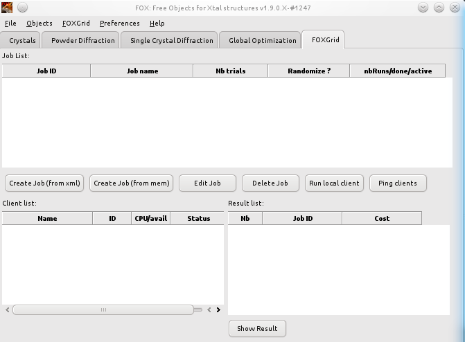

.. _manual_foxgrid:

Fox.Grid distributed computing
==============================
*The Fox.Grid was developed by Jan Rohlíček and Michal Hušák (Institute of Chemical Technology, Department
of Solid State Chemistry, Prague,Czech Republic), in collaboration with V. Favre-Nicolin.*

Introduction
------------

FOX.Grid is an extension of FOX with additional grid (distributed computing) features.
FOXGrid code works in following way: One instance of FOX is sending jobs to another
FOX instances on the net or on the same multi-core PC. The problem is solved in parallel
runs, and allows to solve more complex structures or problems
requiring “brute force” approach.

This method can be used either:

* on a single computer, using as many clients as the number of cores on the computer
* on computers available on the network - clients must be connected to the server from each computer

Running the server
------------------
Start the server
^^^^^^^^^^^^^^^^
To run the server: in the main menu select ``FOXGrid->Run Server``. The FOXGrid tab window
should look like the following:

Adding jobs to the server
^^^^^^^^^^^^^^^^^^^^^^^^^
A "Job" consists of a FOX *\*.xml* or *\*.xml.gz* data file which describes the required run and contains all
needed objects (e.g. Crystal, Powder Pattern and Monte-Carlo,...). This file can be created in the FOX GUI
by using standard FOX's menus (file->save as).

To create a job in the server, use one of the **Create Job** buttons in the FOXGrid server GUI. There are two
methods:

* creating job from an existing file
* creating job from program memory (it creates the job from currently loaded data).

After pressing one of the "Create job" buttons you should fill up the job settings parameters:

* Job ID - read only - ID of the job.
* Job Name - name of the job
* Number of Trials (the same as "Number of trials per run").
* Number of runs (the same as "Number of runs to perform").
* Randomize - check it and client randomizes data before each run (this is recommended for most jobs).

Modify or delete job by selecting appropriate line and by pressing one of the delete or edit button.

**Warnings**:

* The job *\*.xml* or *\*.xml.gz* file must be a complete FOX file with all required data (including Monte-Carlo object).
* When creating job from FOX memory (from loaded data) - data must be complete for running computation
  (including all needed data).

Running jobs
------------

Running a local client
^^^^^^^^^^^^^^^^^^^^^^
After loading job(s), you can press the "Run local client" button.
The server will detect a number of cores or CPUs in your PC and will offer to run the client (client
will use as many cores or CPUs as you set).
Press OK to run client on your PC. A new window will be opened (the running client) and the computation
process will start in a few seconds.
This will automatically work, so there is no need to configure that client.

This procedure creates a "client" folder with many subfolders and files. 

If you do not run the client on the server, only clients on the network will be used for this job,
and the jobs will be started as soon as clients are available.

Running a network client
^^^^^^^^^^^^^^^^^^^^^^^^

The client can be executed on any PC in the network. Execute the Fox.exe file and select ``FOXGrid->Run Client`` to run Fox as a client.
Go to the FOXGrid tab window and write the FOXGrid server's IP to the appropriate edit box and set the number of CPUs which will use this client.
Press connect. Client will try to connect to the server. The server will then send data to the client. The client will launch working threads for multiple
FOX runs, and automatically send back results to the server.

Results
-------
To see the results, simply click on one line in the result window, and click the "show result" button below.
