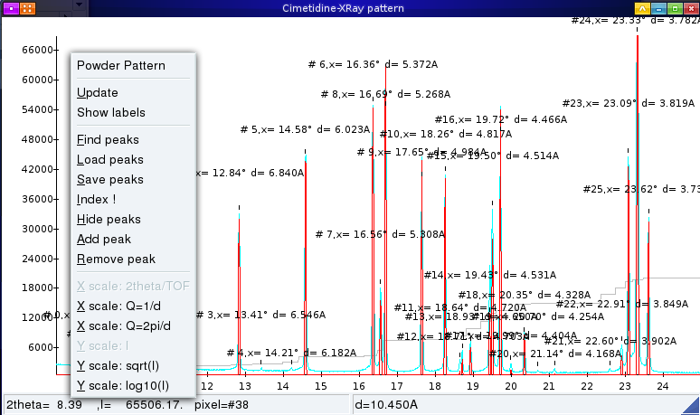
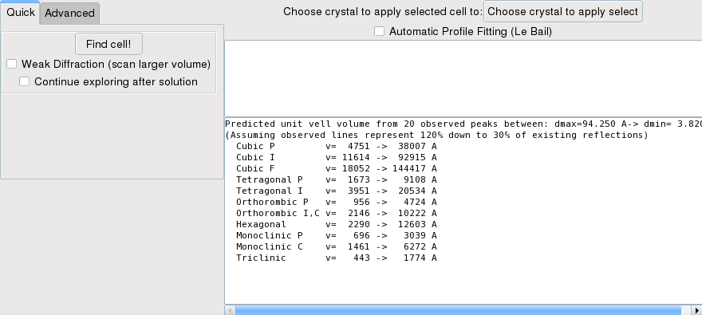
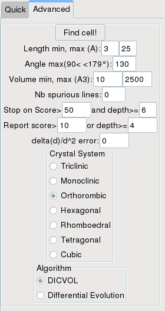
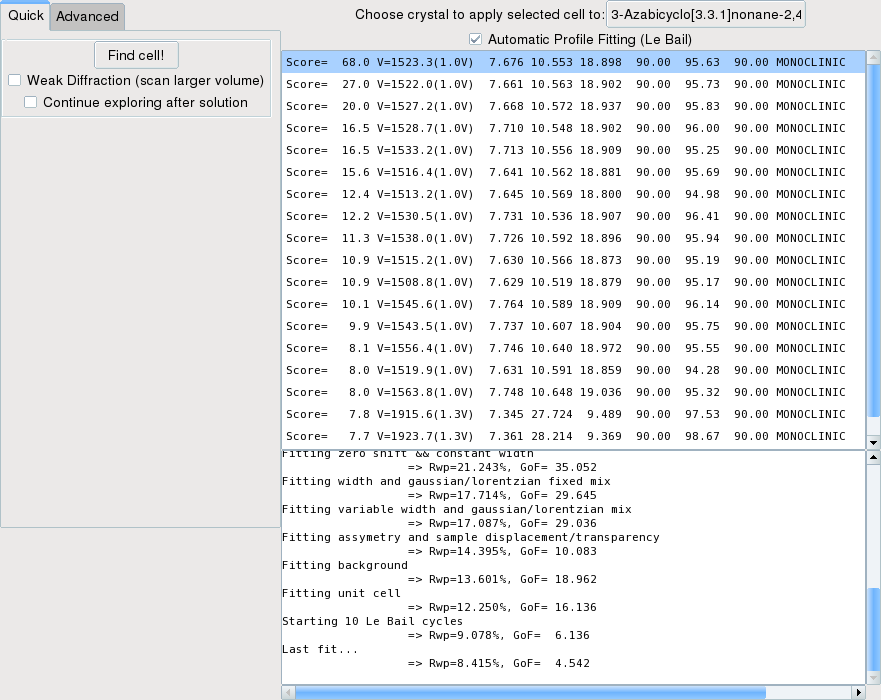

.. _manual_indexing:

Indexing powder patterns using Fox
==================================
*Note*: Fox mostly uses a new implementation of the volume dichotomy algorithm - it is independent from the
`official DICVOL program <http://www.ccp14.ac.uk/ccp/web-mirrors/dicvol/>`_ , and uses different options.
Relevant articles for the dichotmy algorithm are:

* `J. Appl. Cryst. (1972). 5, 271-275: <http://dx.doi.org/10.1107/S0021889872009483>`_ : D. Louër et M. Louër, *Méthode d'essais et erreurs pour l'indexation automatique des diagrammes de poudre*
* `J. Appl. Cryst. 15 (1982), 542-545: <http://dx.doi.org/10.1107/S0021889882012552>`_: D. Louër et R. Vargas, *Indexation automatique des diagrammes de poudre par dichotomies successives*
* `J. Appl. Cryst. 24 (1991), 987-993 <http://dx.doi.org/10.1107/S0021889891006441>`_ : A. Boultif and D. Louër, *Indexing of powder diffraction patterns for low-symmetry lattices by the successive dichotomy method*
* `J. Appl. Cryst. 37 (2004), 724-731 <http://dx.doi.org/10.1107/S0021889804014876>`_ : A. Boultif and D. Louër, *Powder pattern indexing with the dichotomy method*
* `Powder Diffraction 29 (2014), S2, pp. S7-S12 <https://doi.org/10.1017/S0885715614000906>`_ , D. Louër and A. Boultif: *Some further considerations in powder diffraction pattern indexing with the dichotomy method*

Finding peaks
-------------
To search peaks on a powder pattern, open the powder pattern graph, right-click on it and the choose ``Find Peaks`` from the contextual menu.

This should display all found peaks (based on a smoothed second-derivative search) on the graph, each observed line being associated with a number (e.g. ``#10`` for the 10th line) and and the corresponding d-spacing.

You should zoom in (left-click and drag over the desired region of the graph, then you can use left and right arrows to shift the pattern) and **check all indexed lines** to see if they are correct. Most powder patterns should work OK, but noisy ones (showing irregular peaks) may show problems (missing lines, peaks with two detected peaks, etc...).

You can **remove and add peaks manually** using the contextual menu, to remove wrong peaks and add undetected ones. Note however that only the first 20 peaks will be used for indexing, so there is no need to add more. Be sure to add all the low-d peaks which are essential to a fast indexing.

Once you are satisfied with the result, you can **save the peaks** to a file for further use. The file has three columns, ``dobs dwidth iobs``. The ``dobs`` and ``dwidth`` (peak width) are both in Angstroems, and ``iobs`` is currently unused.

Indexing (automatic)
--------------------
To open the indexing dialog, use the ``Index !`` entry of the contextual menu, which will display a new window.

In the window you should click on the ``Find cell!`` button. Fox will then try to index trying all systems, from cubic to monoclinic. If any solution is found with high enough score and dichotomy depth, the search will stop without trying the remaining systems. If you want to **force exploring all systems**, check the ``continue exploring after solution`` checkbox.

For a quick search, the angular range explored goes from 90 to 130°, and the cell length varies depending on the volume estimated for each system.

If Fox does not find any solution in the first search, it will try again allowing spurious peaks (1, then 2 and 3) to be present in the list.

If the search takes too long use the cancel button on the progrees dialog.

If no solution is found and you have a "weak" pattern - meaning that it is likely that a large number of peaks have not been listed, then you can also check the ``Weak Diffraction`` checkbox. This will make the algorithm explore a larger volume for all crystal systems. You can check the volume range explored for each system in the log window at the bottom right (they can be different than the initial volume ranges displayed when opening the window). This may also be useful to find centered cells.

See below how to browse solutions.

Manual indexing
---------------

If quick indexing failed, you can change the search parameters. Normally you should only change the volume
and cell ranges, and optionally the number of spurious peaks. Then check the system you want to search and
click the ``Find Cell!`` button. You can also try to **search for a triclinic cell**.

To **choose the correct volume range**, you should use the **predicted volume ranges listed in the log
window (bottom left)** calculated from the number of peaks observed and their d-values.
Note that the volumes are also listed for centered cells.

Right now the *differential evolution* evolution does not work, so there is no use trying it.

Browse solutions
----------------

Once the search is finished, all results are displayed as a list. For each solution is given: the M(n) score, the cell volume (with the ratio to the volume of the best solution), the cell parameters and the crystal system. Good scores are above 20, or more if peak positions have been accurately reported.

If you select one solution, it will display the predicted positions of all reflections in the powder pattern graph.

You can also **apply the selected cell parameters to an existing crystal object**, using the ``Choose Crystal`` button at the top of the list of solutions. You will then be prompted to choose an existing crystal object, or a new one will be created for you. Once this is done, each time a solution is selected the cell parameters will be applied to the crystal object, with a basic spacegroup (without extinctions) corresponding to the solution's crystal system.

Additionally, you can also check the **``Automatic Profile Fitting (Le Bail)``** checkbox. Then every time a solution is selected, a n extraction will be done with a succession of (i) Le Bail Fit (1à cycles) (ii) least-squares profile fitting with increasing free parameters (starting from constant width and zero error, to background and unit cell parameters) (iii) another Le Bail extraction (10 cycles) and finally (iv) a final profile fit with all free parameters. The results of each optimization (Rwp and GoF) is written in the log window (see the above example image.

If you wish to further optimize the profile parameters (do more cycles to diminish Rwp and GoF further) , you can do it from the :ref:`profile fitting interface <manual_profile_fitting>`.
