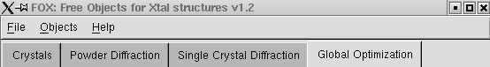

.. _manual:

##########
Fox Manual
##########

Note that Fox can store some :ref:`preferences <manual_preferences>` between sessions].

Command-line options
====================
(how to launch optimizations from the command-line, without a graphical interface - useful for scripts or using a cluster) It is possible to use command-line arguments for Fox (use ```Fox --help``` to get all options), e.g.:

* ``Fox silicon.xml``: will load the silicon.xml file and launch the GUI.
* ``Fox silicon.cif``: will load the silicon.cif CIF file, try to extract any crystal structure
  or powder pattern data from that CIF file and will launch the GUI. See [:Manual/CIF: this page]
  on Fox support for CIF import.
* ``Fox silicon.xml --nogui -n 10000 -o out.xml --nbrun 10``: will load the silicon.xml file, and
  run the optimization without GUI for 10000 trials, for 10 runs, then output the best solution to out.xml.
* ``Fox example/pbso4-joint.xml --nogui --randomize -n 100000 --nbrun 10 --finalcost 1000 -o test.xml``:
  will run Fox (without GUI) on the PbSO4 example for at most 100000 trials after first randomizing the
  structure (useful for tests), and stop the optimization when the overall cost falls below 1000; this
  is repeated for the 10 runs then the best solution is stored in test.xml.
  You can run that one from the main Fox directory.
* ``Fox alumina.xml --loadfouriergrd alumina.grd`` will load the alumina.xml file, and display the first
  crystal structure in 3D, and load the fourier map as well. The .grd fourier map can be generated by
  *expgui*, *gsas*, and the *forgrid* package (*NB: this is probably way out-dated*).
* ``Fox alumina.xml --loadfourierdsn6 alumina.DN6`` : will load a DSN6 fourier map and display it with
  the first crystal structure in the xml file. The DSN6 fourier map can be created using the 'O' command
  in GSAS forplot ("Convert map to DSN6 format"). You must use a z-sliced fourier map, and the fourier
  map must go from 0.0 to 1.0 along all 3 directions, as Fox does not take care of filling the remaining
  of the Fourier map by symmetry.
* ``Fox --speedtest``: Do a speedtest of Fox (takes about 2mn).

***********************************
Graphical Interface (GUI) reference
***********************************

Note About Parameters
---------------------
* All the parameters that can be optimized in Fox have two **checkboxes** between the name and the
  field where you can read and enter the value for the parameter. The left checkbox (R) can trigger
  the **refinable** status of the parameter (unchecked= not optimized), and the right one (L) enables
  the **limits** for that parameter.
* For some parameters (e.g. the atomic positions in a Molecule), you may not have access to these
  fix/limit buttons, because the functionnality to restrain the evolution parameters is provided at a
  higher level (e.g. in the Molecule object, atomic positions are limited relatively to each other
  through intelligent restraints, *not* individual limits).
* Also, some parameters who *do* have R/L checkboxes *cannot* be optimized by Fox, because it does
  not make sense to refine some parameters using a global optimization algorithms. See the FAQ for
  a few more details.

Main Menus
----------


* The ``File`` menu allows to save or load a "project" file in which are saved Crystal structures,
  diffraction data and algorithms... Everything which can be seen in the Fox main window is saved.
  It is stored using an **XML** format specific to Fox/ObjCryst++ (*note that the xml file is easily
  readable, so you can edit it if necessary*). You can also :ref:`load CIF (Crystallographic
  Information File) files <manual_cif>`. You can also exit through this menu.
* The ``Objects`` menu can be used to create new ``Crystal``, ``PowderPattern``,
  ``DiffractionDataSingleCrystal`` or algorithms objects. Remember that you can create several
  of these objects simultaneously (limited only by memory !).
* The ``Preferences`` menu: see :ref:`manual_preferences`
* The ``Help`` menu gives you access to the "about box" of Fox, and you can toggle the use of **tooltips**.

Below the menus you have **4 tabs**, where you can respectively find the *Crystal*,
*Powder Pattern*, *Single Crystal* and optimisation *algorithms* details.

.. toctree::
  :maxdepth: 1
  :caption: Crystal structure description

  manual-crystal

.. toctree::
  :maxdepth: 1
  :caption: Powder patterns

  manual-powder
  manual-profile-fitting
  manual-indexing

.. toctree::
  :maxdepth: 1
  :caption: Single crystal data

  manual-single-crystal-diffraction

.. toctree::
  :maxdepth: 1
  :caption: Algorithms

  manual-algorithms

.. toctree::
  :maxdepth: 1
  :caption: Other topics

  manual-cif
  manual-foxgrid
  manual-preferences
  manual-tips
  faq
