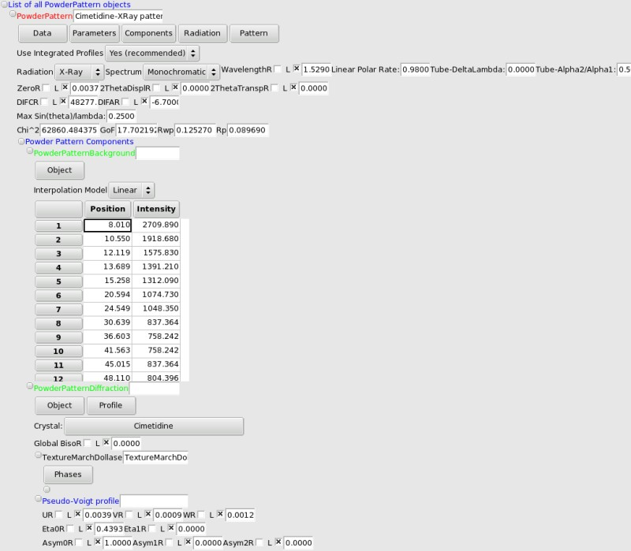
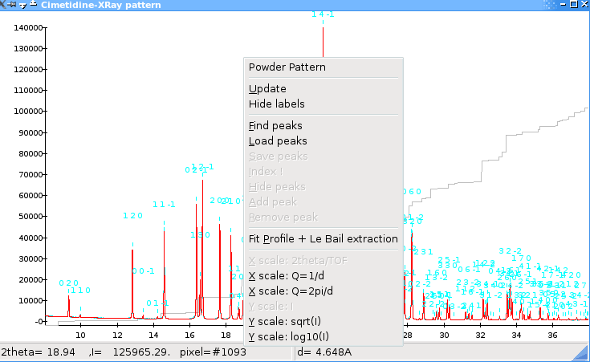

.. _manual_powder:

Powder Pattern Diffraction data
===============================

Powder Menus
------------
* ``Data`` allows to import several types of data. If you wish to add another format, send me an email with an example data, and saying why you think it is important that this format is supported. You can also save the calculated and observed spectra, and use the 'simulation mode', which will use a dummy observed pattern (I=1. in all points).
* ``Export`` allows to [[#export|export the powder pattern and the related crystal structures]] (currently only for Fullprof).
* ``Parameters`` allows you to fix all parameters. Note that only preferred orientation parameters and the global temperature factor are refinable anyway.
* ``Components`` is the menu to describe your powder pattern in terms of the sum of *components*, which can be one interpolated background, and **any number of crystalline phases**.
* ``Radiation`` allows you to choose the radiation for your experiment. It is also possible to use the radiation interface just below the menus, but to choose an X-Ray tube it is easier that way (unless you know by heart the delta-lambda !). Do not forget to input the correct polarization rate (typically 0.95 for a synchrotron experiment, and 0 for a laboratory diffractometer without monochromator).
* ``Pattern`` allows you to open the [[#graph|graph window]] with the observed and calculated patterns, and to fit the scale factor. It is also possible to add "excluded 2-theta zones" which will be ignored during global optimization: you will be prompted for the minimum and maximum 2theta values of the region to ignore (to remove those regions, you have to edit the xml file).

Powder Pattern graph
--------------------

The powder pattern graph window displays the **calculated** (in red) and **observed** (in blue, with small grey bars to indicate the observed esd's) powder patterns. The gray line which increases from left to right is the *cumulative Chi^2* which can be used to find which parts of the patterns present the worst fit. For a perfect fit (with only statistical errors remaining) it should be a straight line (though in Fox the cumulative Chi2 uses the integrated profiles and therefore looks like a bar chart).

The mouse and keyboard can be used to get more information from the graph:

* Left-click and drag will zoom in the rectangle defined by the points where the buttons were pressed and released.
* Double-clickin with the left button will reset the zoom and show the whole diagram
* '+' will zoom in the x axis, and '-' will zoom out
* '*' will zoom in the x axis, and '/' will zoom out
* left, right, up and down arrows can be used to move around a zoomed portion of the graph

Right-clicking on the graph will open a popup menu, from which you can:

* show/hide the labels (Miller indices)
* search for peaks for [[Manual/Indexing| indexing]]
* activate the [[Manual/ProfileFitting| profile-fitting]] mode
* change the scaling for the x axis (2theta/tof (default), 1/d or 2*pi/d) and the y axis (intensity (default), sqrt(I) or log10(I))

Export
------
*This feature is available since Fox revision #1029, and is still being tested. Only export to Fullprof and constant-wavelength data is available yet (no TOF).*

The ``Export`` menu can be used to create a ``.pcr`` and a ``.dat`` file suitable for
`Fullprof <http://www.ill.eu/sites/fullprof/>`_.

Notes about the .pcr file:

* it includes the background and crystal structure description
* bond and angle restraints are included whenever a Molecule is exported (no dihedral or rigid body restraint)
* preferred orientation is not included yet
* the pcr file uses the multi-pattern format
* only the scale factor is initially set to be refined. The scale factor is set to 1.0, so no other parameter should be refined before a correct scale factor has been obtained
* once a correct scale factor has been obtained, you can progressively add other pârameters: profile, lattice, instrumental corrections, background, and finally atomic parameters...

Radiation
---------
Here you can describe the radiation corresponding to your experiment (neutron, X-Ray, tube,...). The wavelength is in Angstroem as usual. Set the polarization rate between 0.95 and 1 for synchrotron experiments, and 0 for an X-Ray tube (actually if you use a monochromator it should be above 0, but a precise value is not critical for a global optimization).

You can also select *Neutron Time Of Flight*. You will need to enter the **DIFA** and **DIFC** parameters corresponding to the instrument the data was recorded on.

2theta correction parameters
----------------------------
These parameters allow to correct for experimental errors in the 2theta positions of reflections, due to a wrong zero, or a misplacement of the sample holder or its transparency. For most data sets, using the 2theta zero is sufficient. After each change, you can right-click on the powder pattern graph to update it.*You should* **always** *check that all peaks are correctly and precisely indexed before launching an optimization*.

Maximum sin(theta)/lambda
-------------------------
Use this field to limit the extent of the calculations on the powder pattern. It is usually a very good idea to do that, since for a global optimization, high-angle data is useless. A good value is 0.25 Angstroem\ :sup:`-1`\  (corresponding to a resolution of 2 Angstroems), although you can go higher to 0.4 A\ :sup:`-1`\  if you feel there are not enough reflections...

Powder Pattern Background
-------------------------
The background can be modelized using either *linear* or *[[http://en.wikipedia.org/wiki/Cubic_spline|cubic spline]]* interpolation between user-chosen 2theta (or tof) values. The easiest way to create the background is to use the **automatic Bayesian (Sivia-David) background estimation**: use  the ``Components->Add Bayesian Background (automatic``. You will be prompted to choose the number of interpolation points (10 to 20 should be OK, depending on how much structure there is in the background). FOX will then spend a few seconds finding the best background

To input the (2theta, intensity) points you can also create a text file with a list of "2theta intensity" on each line (2theta in degrees), and load it using the menu.

If you want to change the points (either the intensity or the position), just edit the values in the grid.

There is currently no limit to the number of points, but even for complex backgrounds 20 should be enough.

PowderPatternDiffraction: Crystalline phase contribution to the powder pattern
------------------------------------------------------------------------------
This allows to describe the contribution of a crystalline phase to the powder pattern. It is possible to save the calculated structure factors using the menu (note that structure factors above the chosen sin(theta)/lambda limit are not calculated).

* **Profile parameters**: using the ``profile`` menu, you can use the following models:

  * *Pseudo-Voigt*, for constant wavelength experiments (either x-ray or neutrons). The follwong parameters are available:

    * U, V, and W define the width using Caglioti's law (W is the constant width, which is generally sufficient if you are using integrated Rfactors as recommended). fwhm=[W+V*tan(theta)+U*tan^2^(theta)]^0.5^
    * Eta0 (constant) and Eta1 (theta-dependant) define the mixing parameter for a pseudo-Voigt profile (eta=eta,,0,,+eta,,1,,*2theta), eta=1 corresponds to a pure Lorentzian and eta=0 to a pure Gaussian.
    * Asym0 (constant),Asym1 and Asym2 (theta -dependant): asymmetry parameters (ratio between intensities on the left and right of the reflection maximum): asym=A,,0,,+A,,1,,/sin(2theta)+A,,2,,/sin^2^(2theta)
  * *Double-exponential pseudo-Voigt*: for neutron time-of-flight data.

* **Crystal choice**: you are asked to choose a crystal structure upon creation of the !PowderPatternDiffraction object. You can change it afterwards by clicking on the crystal name.

* **Global Biso**: this can be used as a global temperature factor for this crystalline phase (affects all atoms). This *is* refinable, although it slows the optimization without helping a lot (it is therefore not recommended *at all* to optimize it !).

Texture (Preferred Orientation) using the March-Dollase Model
-------------------------------------------------------------
FOX supports optimization of Preferred orientation, usign the March-Dollase model. To add one phase, use the "Phases" local menu. You can then enter the fraction, March coefficient (>1 for needles, <1 for plate-like crystallites), and HKL coordinates for the preferred orientation.

**Note**: it is very important to **use this only as a last resort**, or if you know for sure that you have preferred orientation. Taking one more day to prepare carefully a non-textured sample is definitely worth it, since even if a solution is found, it will take **much** longer - preferred orientation reduces the information available in some direction of the crystal.

If you finally decide to search for preferred orientation parameters, you *must* input as much information as possible: you should be able to know what kind of preferred orientation to expect (plates or needles), so that you can restrict the March coefficient to be either >1 or <1 (e.g. use limits [.5;1] or [1;2] - never go below .1 or above 10, that would just slow things). If you know what the preferred orientation vector is, that's even better.

Note that it is possible to use several preferred orientations, but I *strongly* discourage to do this for a global optimization.
