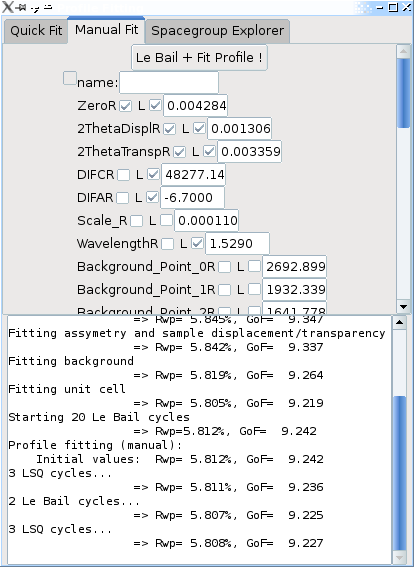
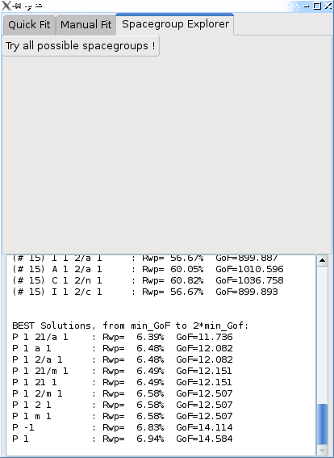

.. _manual_profile_fitting:

Profile fitting and Le Bail intensity extraction
================================================

**Note**: right now this only supports profile fitting with a pseudo-Voigt profile

.. image:: images/lebailmode.png

*Note:* to use profile fitting on a powder pattern you must first have for this pattern (i) a background component and (ii) defined a crystal phase contributing to this pattern (listed as !PowderPatternDiffraction in the window).

To begin profile fitting, the simplest way is to *right-click on the powder pattern graph* and select ```Fit profile + Le Bail extraction```. Alternatively, you can either check the ```Profile Fitting (Le Bail) mode``` check box (see above), or use the ```profile``` menu in the !PowderPatternDiffraction object.

A window will appear whith 3 tabs, from which you can do an quick/automatic manual profile-fitting, and use the spacegroup explorer. Le Bail intensity extraction is done automatically during each profille fitting refinement.

Quick, automatic profile fitting
--------------------------------

 .. image:: images/profilefitting-quick.png

In the quick mode, you can check which types of profile parameters you want to optimize. It will then do 10 Le Bail cycles, followed by a series of profile fitting least squares refinement, with an increasing number of free parameters - depending on your choices. The optimization can be canceled  using the progress dialog, and the results (Rwp and GoF are displayed in the log window - see the example above).

If the refinement diverges at some point, you should remove some groupes of parameters from the optimisation. As Fox increases slowly the number of parameters which are optimised, this should only happen if you start far from the final values. Alternatively, you can switch to the [[#manual|manual]] mode, where individual parameters can be selected.

Once you have performed the extraction, you can [[Manual/Crystal#Fourier|display observed & difference Fourier maps]] in the 3D Crystal view.

**Note 1**: as long as the ```Profile Fitting (Le Bail) mode``` box is checked, all pattern calculations will of course ignore the actual crystal structure. So if you want to optimize a crystal structure, you must first un-check this first ! This is automatically done after you close the profile fitting window.

**Note 2**: the default in Fox is to optimize only the lower parts of the powder pattern first. The drawback of this approach is tha the angle-dependent parameters can go wrong - typically U,V,W width parameters which cause negative width at high angle. In case of a problem when increasing the calculation limit, you should reset the U and V parameters to zero and refine them again. Or you can change the ```max sin(theta)/lambda``` to include the complete powder pattern in the optimization.

Manual profile fitting
----------------------


In the manual mode, you are presented with a list of all available parameters affecting the profile. You can then check those that you want to refine, by clicking the box next to the **R** for each parameter (the **L** box indicates that the profile is limited - right-click on the parameter name to change the limits). Then you can click on the *Le Bail + Fit Profile !* button, and a few Le Bail and least squares cycles will be performed.

**Note**: the list of available parameters is extensive, and some parameters which are listed may not be used for your type of profile ! Try to select only those that are used. Fox will automatically fix parameters with null derivatives.


.. _manual_spacegroup_explorer:

Spacegroup explorer
===================



Clicking the *Try all possible spacegroups !* will perform a profile fitting on every spacegroup setting (among 530) which are compatible (or almost compatible) with the unit cell dimensions, reporting the Rwp and GoF for each one.

This exploration can take a few minutes for a monoclinic unit cell, usually 15' to 1h for an orthorhombic one, and longer for cubic unit cells... The first refinement (in P1) is the longest, as all parameters are fitted - afterwards each spacegroup setting takes a few seconds.

*Note:* for a faster exploration, you should select a low "maximum sin(theta)/lambda" (such as 0.25) in the powder pattern window, since the high-resolution part of the pattern will not help discriminate between space groups.

At the end the log window will list the best results with increasing GoF, starting from the minimal GoF, up to twice that value.

**Important:** the true spaceroup will not necessarily be the one with the lowest Rwp/GoF ! Ususally there will be group of spacegroup settings which have systematic extinctions compatible with the observed pattern, and will all have an Rwp or GoF close to the best. In the case of Cimetidine (above graph), the "P 1 21/a 1" correct result is the #1 solution, but this won't always be the case. For the potassium tartrate sample, the "P 21 21 21" correct result is listed as the 11th solution, with Rwp=5.06% (the best having an Rwp=4.92%).

