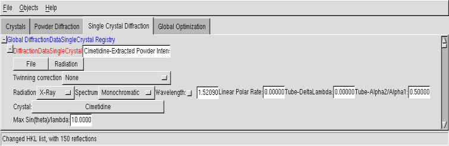

.. _manual_single_crystal_data:

Single Crystal Diffraction data
===============================

Note that the support for single crystal data is limited, as generally direct methods will do a quick
job out of any good single crystal data. This is nevertheless provided, since in some cases the robustness
of direct-space methods can make a difference. The 'intensities' which are to be imported into Fox must be
fully corrected (absorption & Lorentz-Polarization), so that you actually need \|F(hkl)\|^2.

Menus
-----
You can use the menus to load data from a text file (either four columns H K L Iobs, or five columns H K L Iobs sigma). If you do not have data, you can also use the "simulation mode" and generate a full list of H K L up to a given 2theta value. Finally, you can export the structure factors in a text file.

'Group reflections' option
--------------------------
This can be used if, instead of comparing calculated intensities individual reflections, you want to compare the sum of the intensities of a group of reflections.
 * **"no"**: this is the normal behaviour, which most people will want.
 * **"Sum equally-spaced reflections"**: This is a "trick" to have a very basic handling of twinned single crystal data. If selected, comparison between observed and calculated intensities will not be made on individual reflections, but on the sum of intensities of reflections with approximately identical 2theta angle (i.e. not only equivalent reflections). This allows to search for a crystal structure without any knowledge on the type of twinning, effectively handling the data as "powder data".
 * **"Sum according to user data"**: this case corresponds to data were reflections were overlapping and only the integrated intensity over groups of reflections could be obtained. Use *Import Reflections with group intensity* to read the data. The format should then consist of one reflection per line - all reflections are grouped in the file : first the list of h k l coordinates of reflections (1 per line), and the last reflection of the group has an additional observed intensity I,,obs,, (and optionnaly another additional sigma(I,,obs,,), otherwise sigma will be take as the square root of I,,obs,,). Different groups may have different numbers of reflections (possibly just 1 also). Example data file that can be imported (the format is not fixed, use any number of spaces for field separation on each line):

.. code-block:: none

   4   0   2   890.0
  -4   0   3   170.2
   4   0   1    63.5
  -4   0   2     5.0
   4   0   0   152.9
  -4   0   1   299.6
  -2  -3   3
  -2   3   3     6.4
   2   3   2
   2  -3   2     8.8
  -2  -3   2
  -2   3   2  2052.8
  -3  -2   3
  -3   2   3
   3  -2   2
   3   2   2    23.1

Radiation
---------
:ref:`Same as for powder pattern... <manual_powder>`

Crystal
-------
You can click on the crystal name to change the crystal structure associated to this data.

Maximum sin(theta)/lambda
-------------------------
:ref:`Same as for powder pattern... <manual_powder>`
