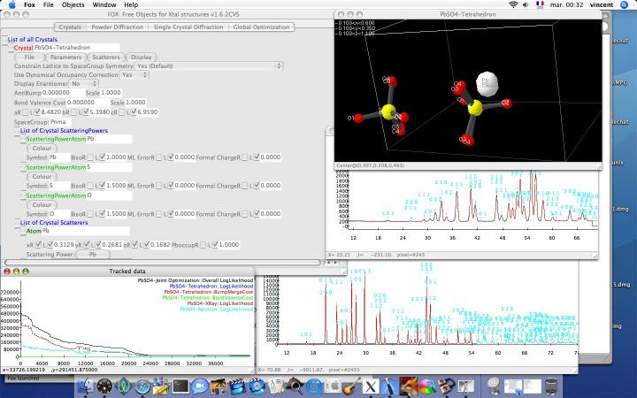
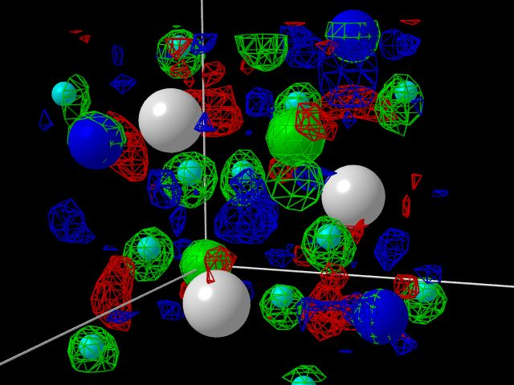
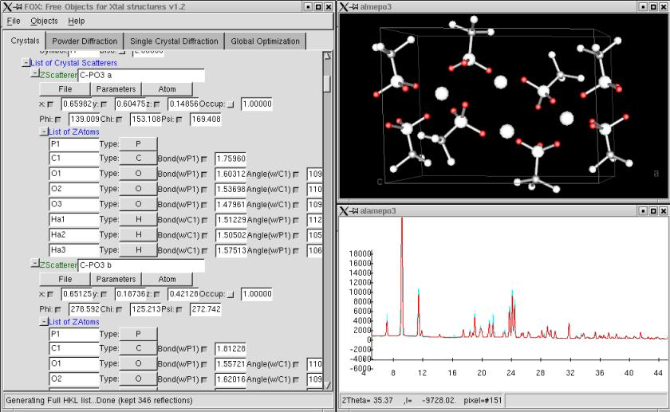
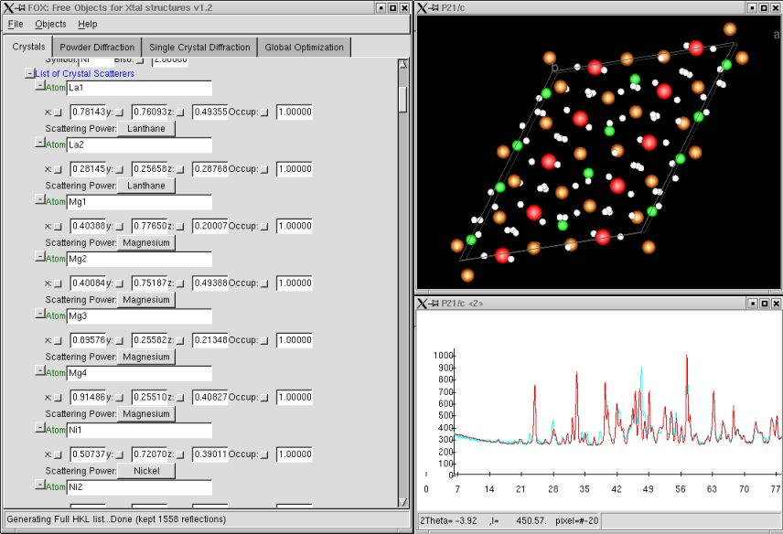
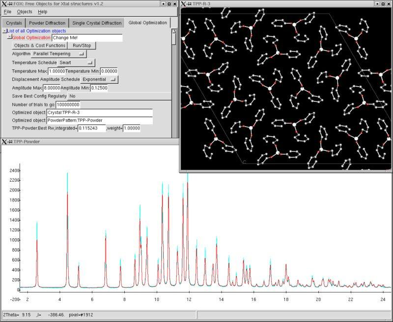
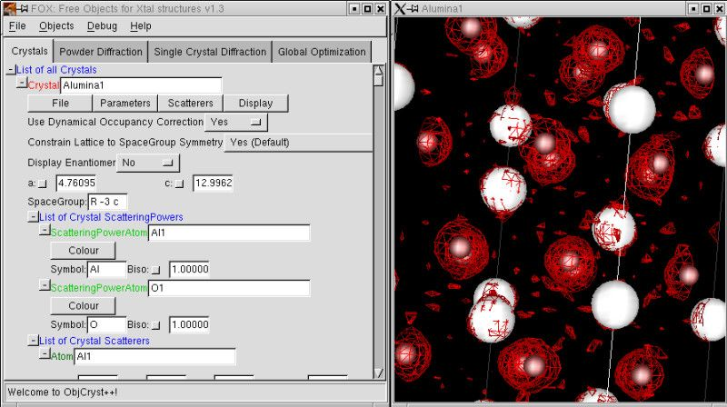

.. _screenshots:

Screenshots
===========

  July 2005: Fox can now run on Mac OS X using the native "Aqua" look

  November 2003: Fox can now export 3D Crystal views for `POV-Ray <http://www.povray.org>`_ rendering

.. figure:: images/ktartrate-pov.jpg

  For this image (potassium tartrate), the reflection for atoms was changed to 1.0 to get
  the mirror reflectivity effect.

  Fox working on an aluminimium methyl-phosphonate structure, solved using Fox by Mark Edgar
  *et al.* at the University of St Andrews (Scotland).

  Fox working on the new hydride structure LaMg\ :sub:`2`\ NiD\ :sub:`7`\  , solved using Fox by
  Guillaume Renaudin *et al.* at the University of Geneva (Switzerland).
  22 atoms in general position, solved by using X-Ray and neutron powder patterns.

  Fox tested on the Triphenyl Phosphite structure.

  Fox displaying the Alumina structure with the GSAS/EXPGUI Fourier map.
